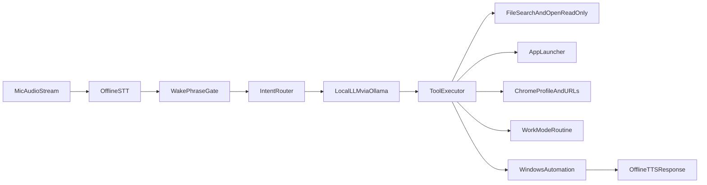

# JARVIS-Lite (Local, Free) Implementation Plan

## Goal
Build a fully local AI assistant for your Windows laptop that:
- Listens for a wake phrase and voice commands
- Understands natural language (locally)
- Can search/open files (no delete capability)
- Can launch apps and automate browser tasks
- Can trigger a “work mode” routine (new desktop + apps + Chrome profile + song)
- Runs with zero API/hosting cost

## Recommended Local Stack (Free)
- **Language:** Python 3.11+
- **LLM runtime:** Ollama (local)
- **Primary model:** `qwen2.5:7b-instruct` (good quality/speed on 16GB RAM), fallback `llama3.1:8b`
- **Speech-to-Text (offline):** `faster-whisper` (small or medium model, GPU-enabled)
- **Text-to-Speech (offline):** `pyttsx3` (Windows SAPI)
- **Wake/Hotkey input:** `keyboard` + `pynput`
- **Automation:** `subprocess`, `pyautogui`
- **Optional UI:** minimal tray/status app later with `pystray`

## High-Level Architecture

## Security-by-Design (No Delete Access)
- Expose only allowlisted tools to the agent.
- Implement **read/open-only** file operations:
  - Allowed: list/index/search/open/read metadata
  - Disallowed: delete/move/rename/write by default
- Validate every tool call against a permissions policy.
- Maintain an allowlist of root folders to scan.
- Add command confirmation for sensitive actions (e.g., opening many apps).

## Project Structure (Cursor)
Create this structure as you implement:
- [`jarvis-lite/main.py`](jarvis-lite/main.py) - app entrypoint, process startup
- [`jarvis-lite/config/settings.yaml`](jarvis-lite/config/settings.yaml) - wake phrase, profile names, routine config
- [`jarvis-lite/core/assistant_loop.py`](jarvis-lite/core/assistant_loop.py) - runtime orchestration loop
- [`jarvis-lite/core/intent_router.py`](jarvis-lite/core/intent_router.py) - intent parsing and tool selection
- [`jarvis-lite/voice/stt.py`](jarvis-lite/voice/stt.py) - mic capture + whisper transcription
- [`jarvis-lite/voice/tts.py`](jarvis-lite/voice/tts.py) - TTS output
- [`jarvis-lite/tools/file_tools.py`](jarvis-lite/tools/file_tools.py) - index/search/open read-only tools
- [`jarvis-lite/tools/app_tools.py`](jarvis-lite/tools/app_tools.py) - app launch registry + commands
- [`jarvis-lite/tools/browser_tools.py`](jarvis-lite/tools/browser_tools.py) - Chrome profile launch and tab restore
- [`jarvis-lite/tools/routine_tools.py`](jarvis-lite/tools/routine_tools.py) - work routine workflow
- [`jarvis-lite/system/hotkey_listener.py`](jarvis-lite/system/hotkey_listener.py) - hotkey/gesture trigger
- [`jarvis-lite/system/windows_virtual_desktop.py`](jarvis-lite/system/windows_virtual_desktop.py) - virtual desktop actions
- [`jarvis-lite/safety/policy.py`](jarvis-lite/safety/policy.py) - centralized permission checks
- [`jarvis-lite/data/app_registry.json`](jarvis-lite/data/app_registry.json) - app name -> executable mapping
- [`jarvis-lite/data/workspaces.json`](jarvis-lite/data/workspaces.json) - predefined “start work” routines
- [`jarvis-lite/requirements.txt`](jarvis-lite/requirements.txt) - pinned dependencies

## Build Phases

### Phase 0 - Environment Setup (Day 1)
- Install Python, FFmpeg, Ollama, and a local model.
- Confirm local inference latency and memory footprint.
- Create a virtual environment and baseline project structure.
- Add logging early for troubleshooting.

### Phase 1 - Voice Core (Day 1-2)
- Implement microphone capture loop in [`jarvis-lite/voice/stt.py`](jarvis-lite/voice/stt.py).
- Add wake phrase detection (e.g., “jarvis wake up”).
- Implement TTS confirmations in [`jarvis-lite/voice/tts.py`](jarvis-lite/voice/tts.py).
- Validate end-to-end: hear wake phrase -> transcribe -> speak reply.

### Phase 2 - Intent + Local LLM (Day 2-3)
- Implement [`jarvis-lite/core/intent_router.py`](jarvis-lite/core/intent_router.py).
- Add structured intent schema (JSON output from LLM):
  - `open_app`, `search_file`, `open_file`, `chrome_search`, `start_work_mode`
- Add fallback rule-based parser for simple commands if LLM fails.
- Keep prompts local and strict to reduce hallucinations.

### Phase 3 - Safe Tools Layer (Day 3-4)
- Build file index + search tool (read/open only) in [`jarvis-lite/tools/file_tools.py`](jarvis-lite/tools/file_tools.py).
- Build app launcher in [`jarvis-lite/tools/app_tools.py`](jarvis-lite/tools/app_tools.py).
- Build browser launcher in [`jarvis-lite/tools/browser_tools.py`](jarvis-lite/tools/browser_tools.py).
- Add policy guards in [`jarvis-lite/safety/policy.py`](jarvis-lite/safety/policy.py) and enforce before each action.

### Phase 4 - JARVIS Work Routine (Day 4-5)
- Implement hotkey trigger in [`jarvis-lite/system/hotkey_listener.py`](jarvis-lite/system/hotkey_listener.py).
- Require trigger combo + phrase (two-factor trigger to avoid accidental starts).
- Implement routine execution in [`jarvis-lite/tools/routine_tools.py`](jarvis-lite/tools/routine_tools.py):
  - Create new virtual desktop
  - Launch Cursor/Chrome/other work apps
  - Open predefined URLs in a chosen Chrome profile
  - Open YouTube song URL and autoplay

### Phase 5 - Reliability + UX (Day 5-6)
- Add command cooldown/debouncing and robust error handling.
- Add “what I heard” confirmation for ambiguous commands.
- Add local session memory (recent commands, last opened files/apps).
- Add startup-on-boot option once stable.

### Phase 6 - Packaging (Day 6-7)
- Convert to single Windows executable (`pyinstaller`) for easy daily use.
- Add config templates and quick-start docs.
- Keep the project modular for future upgrades (vision, reminders, calendar, etc.).

## Command/Intent Contract (Suggested)
- Natural command -> parsed into safe action object:
  - `{"intent":"open_app","app":"chrome"}`
  - `{"intent":"chrome_search","query":"best keyboard shortcuts for cursor"}`
  - `{"intent":"start_work_mode","workspace":"default"}`
- Tool layer executes only known intents; unknown intents are rejected with voice feedback.

## Testing Plan
- Unit tests for intent parsing and safety policy.
- Integration tests for app launch + file search + browser opening.
- Manual speech tests in noisy/quiet environments.
- Routine test checklist:
  - hotkey recognized
  - phrase recognized
  - desktop created
  - apps opened
  - Chrome profile correct
  - song started

## Definition of Done (MVP)
- Wake phrase works offline with acceptable accuracy.
- Assistant can open apps and perform Chrome searches by voice.
- Assistant can search/open local files (no delete actions exposed).
- Work mode trigger reliably starts your predefined workspace routine.
- Fully local operation with no paid API usage.

## First Build Order in Cursor (Practical)
1. Scaffold files + dependencies
2. Implement STT/TTS loop
3. Add intent router + Ollama call
4. Add `open_app` and `chrome_search` tools
5. Add safe `search_file` + `open_file`
6. Add work-mode trigger + routine
7. Harden with policy checks + logs + packaging